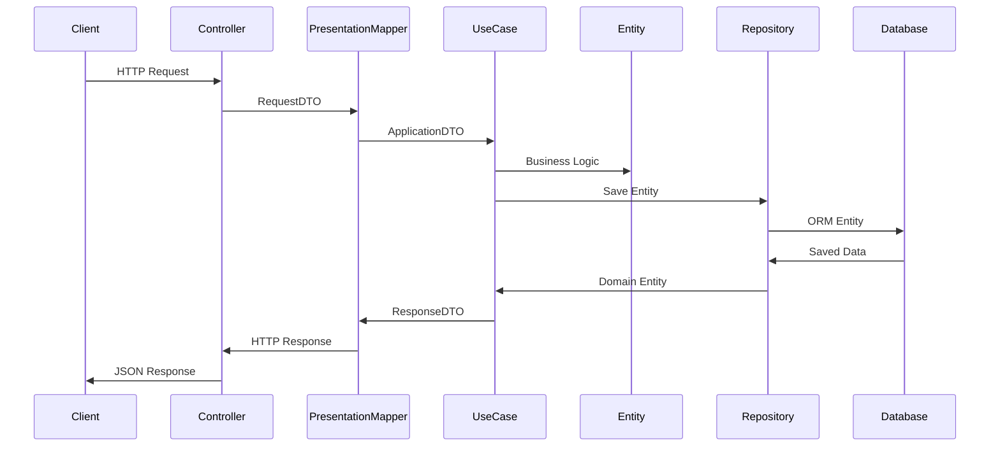
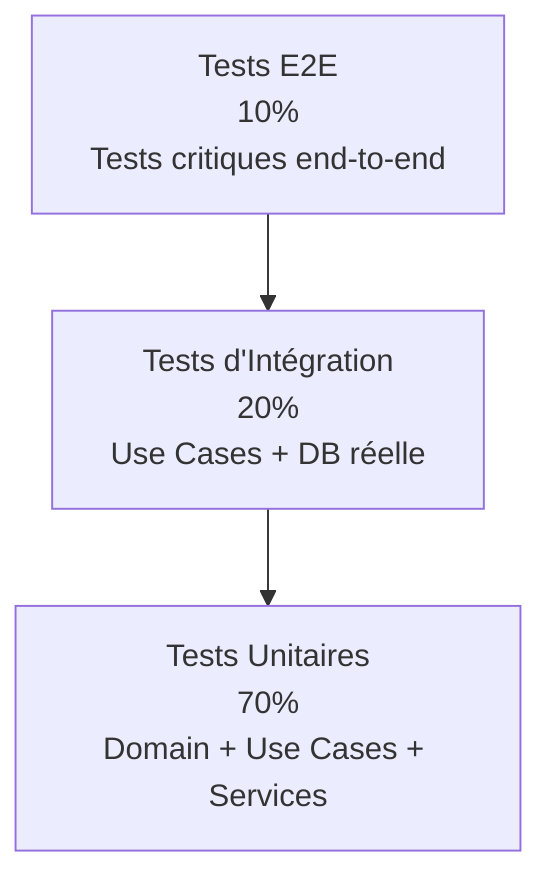

# 🏗️ Guide Architecture Clean + NestJS

## Table des Matières

1. [Vue d'ensemble](#vue-densemble)
2. [Principes architecturaux](#principes-architecturaux)
3. [Structure des modules](#structure-des-modules)
4. [Couches de l'architecture](#couches-de-larchitecture)
5. [Flux de données](#flux-de-données)
6. [Patterns et conventions](#patterns-et-conventions)
7. [Guide d'implémentation](#guide-dimplémentation)
8. [Tests](#tests)
9. [Commandes utiles](#commandes-utiles)

---

## Vue d'ensemble

### 🎯 Objectif du Projet

Application backend NestJS avec architecture Clean pour gérer un système utilisateur complexe incluant :
- **Authentification** (JWT, OAuth Google, MFA, biométrie)
- **Gestion des profils** (RGPD, préférences, photos)
- **RBAC/ACL** (rôles et permissions granulaires)
- **Abonnements** (freemium/premium)
- **Audit et sécurité** (logs, géolocalisation, détection d'anomalies)

### 🏛️ Architecture Choisie

**Clean Architecture + NestJS** : Combinaison de la rigueur architecturale de Clean Architecture avec la productivité de l'écosystème NestJS.



---

## Principes architecturaux

### 🎯 Clean Architecture

1. **Indépendance des frameworks** : Le domaine ne dépend d'aucun framework
2. **Testabilité** : Chaque couche peut être testée isolément
3. **Indépendance de l'UI** : Peut fonctionner avec différentes interfaces
4. **Indépendance de la DB** : Le domaine ne connaît pas la base de données
5. **Règle de dépendance** : Les dépendances pointent vers l'intérieur

### 🚀 NestJS Integration

- **Modules** : Organisation en modules fonctionnels
- **Dependency Injection** : Inversion de contrôle automatique
- **Decorators** : `@Injectable()`, `@Controller()` pour l'infrastructure
- **Guards & Pipes** : Validation et autorisation
- **Events** : Communication asynchrone entre modules

---

## Structure des modules

### 📁 Organisation générale

```
src/
├── modules/                    # Modules métier
│   ├── user/                  # Module utilisateur
│   ├── auth/                  # Module authentification
│   ├── subscription/          # Module abonnements
│   └── audit/                 # Module audit
├── shared/                    # Code partagé
│   ├── domain/               # Entités de base
│   ├── infrastructure/       # Services techniques
│   └── presentation/         # DTOs communs
├── config/                   # Configuration
├── app.module.ts            # Module racine
└── main.ts                  # Point d'entrée
```

### 🏗️ Structure d'un module (exemple: User)

```
user/
├── domain/                   # 🏛️ LOGIQUE MÉTIER PURE
│   ├── entities/
│   │   └── user.entity.ts
│   ├── value-objects/
│   │   ├── email.vo.ts
│   │   └── user-id.vo.ts
│   ├── enums/
│   │   ├── user-role.enum.ts
│   │   └── user-status.enum.ts
│   ├── repositories/
│   │   └── user.repository.ts
│   └── errors/
│       └── user.errors.ts
│
├── application/              # 🎯 CAS D'USAGE
│   ├── use-cases/
│   │   ├── register-user.use-case.ts
│   │   ├── login-user.use-case.ts
│   │   └── update-profile.use-case.ts
│   ├── dto/
│   │   └── user-application.dto.ts
│   ├── mappers/
│   │   └── user-application.mapper.ts
│   └── ports/
│       ├── password.service.ts
│       └── email.service.ts
│
├── infrastructure/           # ⚙️ DÉTAILS TECHNIQUES
│   ├── database/
│   │   ├── entities/
│   │   │   └── user-orm.entity.ts
│   │   └── repositories/
│   │       └── user-typeorm.repository.ts
│   ├── mappers/
│   │   └── user-orm.mapper.ts
│   ├── services/
│   │   ├── bcrypt-password.service.ts
│   │   └── nodemailer-email.service.ts
│   └── adapters/
│       └── google-oauth.adapter.ts
│
├── presentation/             # 🌐 INTERFACE HTTP
│   ├── controllers/
│   │   ├── auth.controller.ts
│   │   └── user.controller.ts
│   ├── dto/
│   │   ├── auth-request.dto.ts
│   │   └── user-response.dto.ts
│   ├── mappers/
│   │   └── user-presentation.mapper.ts
│   └── guards/
│       └── user-ownership.guard.ts
│
└── user.module.ts           # Configuration NestJS
```

---

## Couches de l'architecture

### 🏛️ Domain Layer (Logique Métier)

**Responsabilité** : Contenir la logique métier pure, indépendante de toute technologie.

**Caractéristiques** :
- ❌ Aucun import NestJS (ou très peu)
- ❌ Aucune dépendance externe
- ✅ Logique business encapsulée
- ✅ Validation des règles métier

**Exemples** :
```typescript
// ✅ Bon exemple - Domain Entity
export class User {
  canLogin(): boolean {
    return this.status === UserStatus.ACTIVE && 
           this.loginAttempts < 5;
  }
  
  promoteToAdmin(): void {
    if (!this.isEmailVerified) {
      throw new DomainError('Cannot promote unverified user');
    }
    this.role = UserRole.ADMIN;
  }
}

// ✅ Bon exemple - Value Object
export class Email {
  constructor(private value: string) {
    this.validate(value);
  }
  
  private validate(email: string): void {
    // Validation métier + format
    if (this.isTemporaryEmail(email)) {
      throw new DomainError('Temporary emails not allowed');
    }
  }
}
```

### 🎯 Application Layer (Orchestration)

**Responsabilité** : Orchestrer les cas d'usage en coordonnant les entités et services.

**Caractéristiques** :
- ✅ Use Cases avec `@Injectable()`
- ✅ Injection de dépendance NestJS
- ✅ Orchestration des flux métier
- ✅ Émission d'events

**Exemples** :
```typescript
@Injectable()
export class RegisterUserUseCase {
  constructor(
    private readonly userRepo: IUserRepository,
    private readonly passwordService: IPasswordService,
    private readonly eventEmitter: EventEmitter2
  ) {}

  async execute(dto: RegisterUserDto): Promise<RegisterUserResponseDto> {
    // 1. Créer l'entité (logique métier)
    const user = User.create(dto);
    
    // 2. Services techniques
    const hashedPassword = await this.passwordService.hash(dto.password);
    user.updatePassword(hashedPassword);
    
    // 3. Persistance
    await this.userRepo.save(user);
    
    // 4. Event pour autres modules
    this.eventEmitter.emit('user.registered', { userId: user.getId() });
    
    return this.mapper.toResponseDto(user);
  }
}
```

### ⚙️ Infrastructure Layer (Détails Techniques)

**Responsabilité** : Implémenter les détails techniques (DB, APIs, services externes).

**Caractéristiques** :
- ✅ Implémentations concrètes avec `@Injectable()`
- ✅ Accès aux bases de données
- ✅ Intégrations API externes
- ✅ Services techniques (email, cache, etc.)

**Exemples** :
```typescript
@Injectable()
export class UserTypeOrmRepository extends IUserRepository {
  constructor(
    @InjectRepository(UserOrmEntity)
    private readonly ormRepo: Repository<UserOrmEntity>,
    private readonly mapper: UserOrmMapper
  ) { super(); }

  async save(user: User): Promise<void> {
    const ormEntity = this.mapper.toOrm(user);
    await this.ormRepo.save(ormEntity);
  }
}

@Injectable()
export class BcryptPasswordService extends IPasswordService {
  async hash(password: string): Promise<string> {
    return bcrypt.hash(password, 12);
  }
}
```

### 🌐 Presentation Layer (Interface HTTP)

**Responsabilité** : Gérer l'interface HTTP, validation des entrées, format des sorties.

**Caractéristiques** :
- ✅ Controllers avec `@Controller()`
- ✅ Validation avec `class-validator`
- ✅ Transformation des formats HTTP
- ✅ Gestion des erreurs HTTP

**Exemples** :
```typescript
@Controller('auth')
export class AuthController {
  constructor(
    private readonly registerUseCase: RegisterUserUseCase,
    private readonly mapper: UserPresentationMapper
  ) {}

  @Post('register')
  async register(@Body() requestDto: RegisterUserRequestDto) {
    const applicationDto = this.mapper.toApplicationDto(requestDto);
    const result = await this.registerUseCase.execute(applicationDto);
    return this.mapper.toHttpResponse(result);
  }
}
```

---

## Flux de données

### 🔄 Flux principal (Request → Response)



### 🗂️ Transformation des données (Mappers)

**1. Presentation Mapper** : HTTP ↔ Application
```typescript
// HTTP Request → Application DTO
toApplicationDto(request: RegisterRequestDto): RegisterUserDto {
  return {
    email: request.email,
    password: request.password,
    firstName: request.firstName,
    lastName: request.lastName
  };
}

// Application Response → HTTP Response
toHttpResponse(response: RegisterResponseDto): any {
  return {
    success: true,
    data: {
      user: {
        id: response.id,
        email: response.email,
        fullName: response.fullName
      }
    }
  };
}
```

**2. Application Mapper** : Domain ↔ Application
```typescript
// Domain Entity → Application DTO
toResponseDto(user: User): RegisterResponseDto {
  return {
    id: user.getId(),
    email: user.getEmail(),
    fullName: user.getFullName(),
    status: user.getStatus()
  };
}
```

**3. ORM Mapper** : Domain ↔ Database
```typescript
// Domain Entity → ORM Entity
toOrm(user: User): UserOrmEntity {
  const entity = new UserOrmEntity();
  entity.id = user.getId();
  entity.email = user.getEmail();
  entity.hashedPassword = user.getHashedPassword();
  // ...
  return entity;
}

// ORM Entity → Domain Entity
toDomain(ormEntity: UserOrmEntity): User {
  return User.fromPersistence({
    id: ormEntity.id,
    email: ormEntity.email,
    hashedPassword: ormEntity.hashedPassword,
    // ...
  });
}
```

---

## Patterns et conventions

### 🏗️ Dependency Injection (NestJS)

**Ports (Interfaces) → Adapters (Implémentations)**

```typescript
// user.module.ts
@Module({
  providers: [
    // Use Cases
    RegisterUserUseCase,
    
    // Repositories
    {
      provide: IUserRepository,
      useClass: UserTypeOrmRepository,
    },
    
    // Services
    {
      provide: IPasswordService,
      useClass: BcryptPasswordService,
    }
  ]
})
export class UserModule {}
```

### 📧 Events pour la communication inter-modules

```typescript
// Émission d'event
this.eventEmitter.emit('user.registered', {
  userId: user.getId(),
  email: user.getEmail(),
  registrationDate: new Date()
});

// Écoute d'event dans un autre module
@Injectable()
export class EmailNotificationService {
  @OnEvent('user.registered')
  async handleUserRegistered(event: UserRegisteredEvent) {
    await this.sendWelcomeEmail(event.email);
  }
}
```

### 🛡️ Validation et Authorization

**Validation des entrées (Pipes)**
```typescript
export class RegisterUserRequestDto {
  @IsEmail()
  email: string;
  
  @IsString()
  @MinLength(8)
  password: string;
}
```

**Authorization (Guards)**
```typescript
@Injectable()
export class UserOwnershipGuard implements CanActivate {
  canActivate(context: ExecutionContext): boolean {
    const request = context.switchToHttp().getRequest();
    const user = request.user;
    const targetUserId = request.params.id;
    
    // Logique métier dans l'entité !
    return user.canAccessUser(targetUserId);
  }
}
```

### 🧪 Testing Strategy

**Tests unitaires par couche :**

```typescript
// Test Domain Entity
describe('User Entity', () => {
  it('should not allow login when locked', () => {
    const user = new User({...data, status: UserStatus.LOCKED});
    expect(user.canLogin()).toBe(false);
  });
});

// Test Use Case
describe('RegisterUserUseCase', () => {
  let useCase: RegisterUserUseCase;
  let mockUserRepo: jest.Mocked<IUserRepository>;
  
  beforeEach(() => {
    mockUserRepo = { save: jest.fn(), findByEmail: jest.fn() };
    useCase = new RegisterUserUseCase(mockUserRepo, ...);
  });
  
  it('should register user successfully', async () => {
    mockUserRepo.findByEmail.mockResolvedValue(null);
    
    const result = await useCase.execute(validDto);
    
    expect(mockUserRepo.save).toHaveBeenCalled();
    expect(result.id).toBeDefined();
  });
});
```

---

## Guide d'implémentation

### 🚀 Étapes pour créer un nouveau Use Case

**1. Définir le cas d'usage métier**
```typescript
// Exemple: "Un utilisateur veut changer son mot de passe"
```

**2. Créer les DTOs Application**
```typescript
// application/dto/change-password.dto.ts
export interface ChangePasswordDto {
  userId: string;
  currentPassword: string;
  newPassword: string;
}
```

**3. Implémenter la logique métier dans l'entité**
```typescript
// domain/entities/user.entity.ts
changePassword(currentHash: string, newHash: string): void {
  // Validation métier
  if (this.lastPasswordChangeAt > new Date(Date.now() - 24*60*60*1000)) {
    throw new DomainError('Cannot change password twice in 24h');
  }
  
  this.hashedPassword = newHash;
  this.lastPasswordChangeAt = new Date();
}
```

**4. Créer le Use Case**
```typescript
// application/use-cases/change-password.use-case.ts
@Injectable()
export class ChangePasswordUseCase {
  constructor(
    private readonly userRepo: IUserRepository,
    private readonly passwordService: IPasswordService
  ) {}

  async execute(dto: ChangePasswordDto): Promise<void> {
    const user = await this.userRepo.findById(dto.userId);
    if (!user) throw new ApplicationError('User not found');
    
    const isCurrentValid = await this.passwordService.verify(
      dto.currentPassword, 
      user.getHashedPassword()
    );
    if (!isCurrentValid) throw new ApplicationError('Invalid current password');
    
    const newHash = await this.passwordService.hash(dto.newPassword);
    user.changePassword(user.getHashedPassword(), newHash);
    
    await this.userRepo.save(user);
  }
}
```

**5. Ajouter l'endpoint HTTP**
```typescript
// presentation/controllers/user.controller.ts
@Put(':id/password')
@UseGuards(JwtAuthGuard, UserOwnershipGuard)
async changePassword(
  @Param('id') id: string,
  @Body() requestDto: ChangePasswordRequestDto
) {
  const applicationDto = this.mapper.toChangePasswordDto(requestDto, id);
  await this.changePasswordUseCase.execute(applicationDto);
  return { success: true, message: 'Password updated successfully' };
}
```

**6. Configurer le module**
```typescript
// user.module.ts
@Module({
  providers: [
    // Ajouter le nouveau Use Case
    ChangePasswordUseCase,
    // ...
  ]
})
```

### 📋 Checklist pour un nouveau module

- [ ] Créer la structure des dossiers (domain, application, infrastructure, presentation)
- [ ] Définir les entités Domain avec leur logique métier
- [ ] Créer les Value Objects nécessaires
- [ ] Définir les interfaces des repositories (ports)
- [ ] Implémenter les Use Cases principaux
- [ ] Créer les entités ORM (TypeORM)
- [ ] Implémenter les repositories concrets
- [ ] Créer les mappers (Presentation, Application, ORM)
- [ ] Définir les DTOs de requête/réponse
- [ ] Implémenter les controllers
- [ ] Configurer le module NestJS
- [ ] Écrire les tests unitaires
- [ ] Documenter les endpoints API

---

## Tests

### 🧪 Stratégie de tests

**Pyramide de tests adaptée :**



**Types de tests par couche :**

```typescript
// Domain Tests (Logique métier)
describe('User Entity', () => {
  it('should validate business rules', () => {
    const user = User.create({...});
    expect(user.canLogin()).toBe(true);
  });
});

// Application Tests (Use Cases)
describe('RegisterUserUseCase', () => {
  it('should orchestrate user registration', async () => {
    // Mock all dependencies
    const result = await useCase.execute(dto);
    expect(result).toBeDefined();
  });
});

// Infrastructure Tests (Repositories)
describe('UserTypeOrmRepository', () => {
  it('should save and retrieve user', async () => {
    // Test with real DB (testcontainers)
  });
});

// Presentation Tests (Controllers)
describe('AuthController', () => {
  it('should handle HTTP requests', async () => {
    // Test HTTP layer
  });
});
```

### 🔧 Configuration des tests

```typescript
// test/jest-e2e.json
{
  "moduleFileExtensions": ["js", "json", "ts"],
  "rootDir": ".",
  "testEnvironment": "node",
  "testRegex": ".e2e-spec.ts$",
  "transform": {
    "^.+\\.(t|j)s$": "ts-jest"
  }
}

// package.json scripts
{
  "scripts": {
    "test": "jest",
    "test:watch": "jest --watch",
    "test:cov": "jest --coverage",
    "test:e2e": "jest --config ./test/jest-e2e.json"
  }
}
```

---

## Commandes utiles

### 🐳 Docker

```bash
# Démarrer l'environnement de développement
make up

# Voir les logs de l'application
make logs

# Accéder au shell du container
make shell

# Arrêter tous les services
make down

# Reset complet de la base de données
make db-reset
```

### 🗄️ Base de données

```bash
# Générer une migration
npm run typeorm:migration:generate -- --name=CreateUserTable

# Lancer les migrations
npm run typeorm:migration:run

# Rollback de migration
npm run typeorm:migration:revert

# Accéder à la DB
make db-shell
```

### 🧪 Tests

```bash
# Tests unitaires
npm run test

# Tests avec couverture
npm run test:cov

# Tests E2E
npm run test:e2e

# Tests en mode watch
npm run test:watch
```

### 🔧 Développement

```bash
# Démarrer en mode dev
npm run start:dev

# Build de production
npm run build

# Linter
npm run lint

# Format du code
npm run format
```

### 📊 Monitoring

```bash
# Logs de l'application
docker-compose logs -f nestjs-app

# Accès à pgAdmin
# URL: http://localhost:8080
# Email: admin@admin.com
# Password: admin123

# Métriques Redis
docker-compose exec redis redis-cli info
```

---

## 🎯 Conclusion

Cette architecture Clean + NestJS te donne :

✅ **Maintenabilité** : Code organisé et prévisible
✅ **Testabilité** : Chaque couche isolée et mockable  
✅ **Évolutivité** : Facile d'ajouter des features
✅ **Flexibilité** : Changer de technologie sans impact majeur
✅ **Productivité** : Conventions claires pour l'équipe

**Règle d'or** : Commence simple, complexifie au besoin. L'architecture doit servir ton projet, pas l'inverse ! 🚀