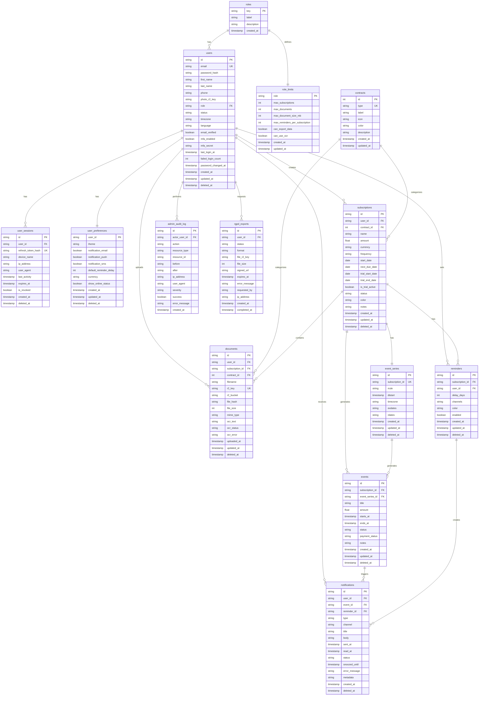

```mermaid
erDiagram

    roles ||--o{ users : has
    roles ||--|| role_limits : defines

    users ||--o{ user_sessions : has
    users ||--|| user_preferences : has
    users ||--o{ subscriptions : creates
    users ||--o{ documents : uploads
    users ||--o{ reminders : sets
    users ||--o{ notifications : receives
    users ||--o{ admin_audit_log : performs
    users ||--o{ rgpd_exports : requests

    contracts ||--o{ subscriptions : categorizes
    contracts ||--o{ documents : categorizes

    subscriptions ||--o{ documents : contains
    subscriptions ||--|| event_series : has
    subscriptions ||--o{ events : generates
    subscriptions ||--o{ reminders : has

    event_series ||--o{ events : generates

    events ||--o{ notifications : triggers
    reminders ||--o{ notifications : creates

    roles {
        string key PK
        string label
        string description
        timestamp created_at
    }

    users {
        string id PK
        string email UK
        string password_hash
        string first_name
        string last_name
        string phone
        string photo_r2_key
        string role FK
        string status
        string timezone
        string language
        boolean email_verified
        boolean mfa_enabled
        string mfa_secret
        timestamp last_login_at
        int failed_login_count
        timestamp password_changed_at
        timestamp created_at
        timestamp updated_at
        timestamp deleted_at
    }

    user_sessions {
        string id PK
        string user_id FK
        string refresh_token_hash UK
        string device_name
        string ip_address
        string user_agent
        timestamp last_activity
        timestamp expires_at
        boolean is_revoked
        timestamp created_at
        timestamp deleted_at
    }

    user_preferences {
        string user_id PK
        string theme
        boolean notification_email
        boolean notification_push
        boolean notification_sms
        int default_reminder_delay
        string currency
        boolean show_online_status
        timestamp created_at
        timestamp updated_at
        timestamp deleted_at
    }

    role_limits {
        string role PK
        int max_subscriptions
        int max_documents
        int max_document_size_mb
        int max_reminders_per_subscription
        boolean can_export_data
        boolean can_use_ocr
        timestamp created_at
        timestamp updated_at
    }

    contracts {
        int id PK
        string type UK
        string label
        string icon
        string color
        string description
        timestamp created_at
        timestamp updated_at
    }

    documents {
        string id PK
        string user_id FK
        string subscription_id FK
        int contract_id FK
        string filename
        string r2_key UK
        string r2_bucket
        string file_hash
        int file_size
        string mime_type
        string ocr_text
        string ocr_status
        string ocr_error
        timestamp uploaded_at
        timestamp updated_at
        timestamp deleted_at
    }

    subscriptions {
        string id PK
        string user_id FK
        int contract_id FK
        string name
        float amount
        string currency
        string frequency
        date start_date
        date next_due_date
        date trial_start_date
        date trial_end_date
        boolean is_trial_active
        string status
        string color
        string notes
        timestamp created_at
        timestamp updated_at
        timestamp deleted_at
    }

    event_series {
        string id PK
        string subscription_id UK
        string rrule
        timestamp dtstart
        string timezone
        string exdates
        string rdates
        timestamp created_at
        timestamp updated_at
        timestamp deleted_at
    }

    events {
        string id PK
        string subscription_id FK
        string event_series_id FK
        string title
        float amount
        timestamp starts_at
        timestamp ends_at
        string status
        string payment_status
        string notes
        timestamp created_at
        timestamp updated_at
        timestamp deleted_at
    }

    reminders {
        string id PK
        string subscription_id FK
        string user_id FK
        int delay_days
        string channels
        string color
        boolean enabled
        timestamp created_at
        timestamp updated_at
        timestamp deleted_at
    }

    notifications {
        string id PK
        string user_id FK
        string event_id FK
        string reminder_id FK
        string type
        string channel
        string title
        string body
        timestamp sent_at
        timestamp read_at
        string status
        timestamp snoozed_until
        string error_message
        string metadata
        timestamp created_at
        timestamp deleted_at
    }

    admin_audit_log {
        string id PK
        string actor_user_id FK
        string action
        string resource_type
        string resource_id
        string before
        string after
        string ip_address
        string user_agent
        string severity
        boolean success
        string error_message
        timestamp created_at
    }

    rgpd_exports {
        string id PK
        string user_id FK
        string status
        string format
        string file_r2_key
        int file_size
        string signed_url
        timestamp expires_at
        string error_message
        string requested_by
        string ip_address
        timestamp created_at
        timestamp completed_at
    }
```